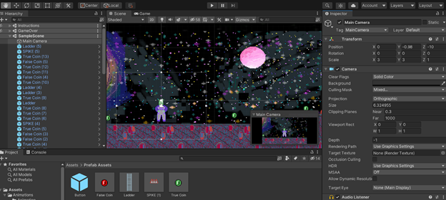
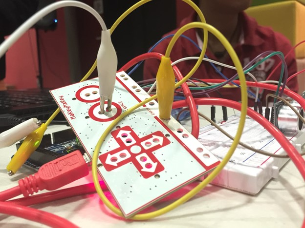

# Using Unity to Teach Game Development and Programming Concepts 

## Description
Boolario is a Mario parody minigame that uses Unity to teach others about game development concepts in a 2D game, such as graphical design, scripting in C#, and hitboxes.  In this program, students will learn about boolean statements by collecting TRUE and FALSE coins to make a logic statement correct.  This program is intented to increase interest in coding and game development by allowing students the opportunity to put their creations into practice as well as share them with others. 

**Our Website:** http://boolario.altervista.org

## Our Team

From left to right: Khamilah Nixon (website designer and game developer), Anya Solodky (graphics and audio designer), and Austin Mathews (game developer)

### Advisors
- Dr. Cengiz Gunay
- Dr. Rahaf Barakat

## Introduction
As the world of technology expands exponentially, Information Technology becomes more relevent. The Technology Ambassador Program (TAP) aims to inspire and motivate non-IT and IT minds in the field of Information Technology.  Our team developed an educational computer game, Boolario, to teach logic statements and game developement concepts to student with various backgrounds. Similar in style and design to its 1985 counterpart, Mario, Boolario utilizes logic statements to manipulate the outcome of collecting coins during gameplay. Our collecting system allows players to collect coins holding both "True" and "False" values to make an "AND" or "OR" logic statement true.

## Goals
- Teaching game development concepts
- Teaching fundamentals of logic statements
- Teaching iteration and randomization

## Publications
1. CCSC abstract - Khamilah Nixon, Anya Solodky, Austin Mathews, Cengiz Gunay, Rahaf Barakat. Boolario, CCSC: Southeastern Region (CCSC:SE), [dates TBA]
2. CREATE Symposium Poster, [date TBA], Georgia Gwinnett College

## Outreach Activities
1. Super Saturday Series (S3), Nov 9, Georgia Gwinnett College = middle and high school girls to promote IT and STEM career
2. TAP Expo, Oct 10, 2021, Georgia Gwinnett College - To promote IT field and the TAP program to college students 
3. Class Workshops - on 2021 Oct 26, Oct 28, and Nov 2 to promote IT field to non-IT college students

## Technology
For this program, our team used [Unity](https://unity.com/), a device that changes a conductor into a source of computer input.

Our team also utlized [Makey Makey](https://makeymakey.com/), a 2D and 3D game engine.

We also used Visual Code Studio to create scripts and PixilArt to design sprites.

### Optional:
- GitHub Desktop
- GitBash
- GitIgnore

## Project Setup/Installation
1. Install Unity and Unity Hub
2. Install WebGL
3. Install Visual Studio Code

**Operating System**: Windows 8 or higher, MacOS
**Programming Languages**: C#

## Usage
1. Open **_Boolario_** folder
2. Open **_Assets_** folder
3. Open any of the **_.unity_** files to begin
4. Once Unity loads, go in the **_Scenes_** folder under **_Assets_**, then drag and drop all the scenes into the **_Hierarchy_** tab
